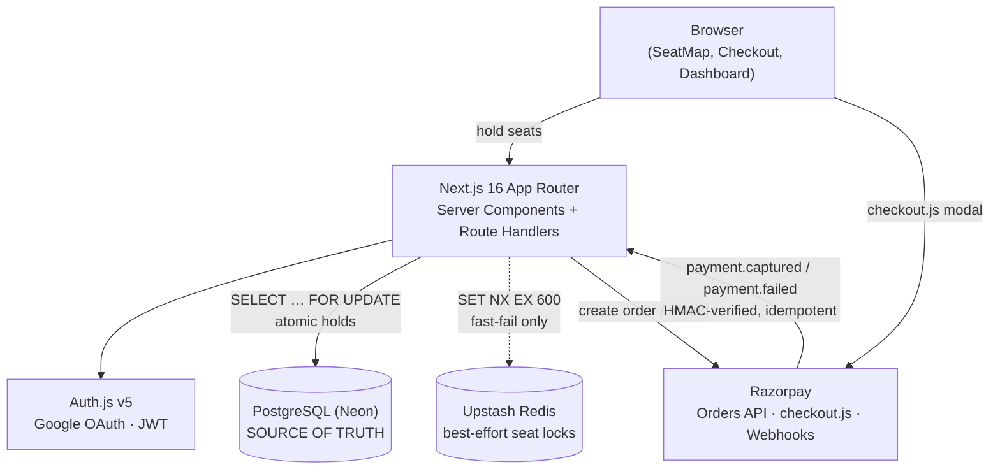

# SeatBook — Event Booking Platform

A full-stack event/class booking platform: interactive seat maps, atomic 10-minute
seat holds, Razorpay payments with verified webhooks, waitlists with 24h offers,
refunds, and an organizer analytics dashboard.

**Stack:** Next.js 16 (App Router) · TypeScript · Tailwind CSS v4 · Drizzle ORM +
PostgreSQL · Auth.js v5 (Google OAuth, JWT) · Razorpay · Upstash Redis · Vercel

## Features

**Bookers**
- Browse published events, pick seats on an interactive tiered seat map
- 10-minute atomic seat holds (Postgres `SELECT … FOR UPDATE`; Redis fast-fail)
- Checkout with live countdown, Razorpay checkout.js payment
- My bookings: continue pending holds, cancel & refund confirmed bookings
- Waitlist on sold-out tiers — first in line gets a 24h offer when seats free up

**Organizers**
- Create events with tiers, rows, prices (seat labels auto-generated: A-1…)
- Publish/unpublish events
- Dashboard: revenue, tickets sold, occupancy, check-ins, per-tier breakdown,
  14-day sales chart, waitlist counts
- Attendee list with check-in toggle and per-booking refunds

## Architecture



### The seat-hold path (the interesting part)

```
pick seats → POST /api/holds
  → BEGIN
  → SELECT seats … FOR UPDATE            (row locks serialize racers)
  → verify all AVAILABLE + same event
  → INSERT booking (PENDING, holdExpiresAt = now + 10 min)
  → UPDATE seats → HELD
  → COMMIT
  → Redis SET NX EX 600 (fast-fail hint for the next request; DB wins)
```

Five concurrent requests for the same seat → exactly one wins (tested).

### Payment state machine

```
PENDING --(verify signature OK)--> CONFIRMED --(refund)--> REFUNDED
   |                                    seats: HELD → SOLD → AVAILABLE
   |--(hold expires / payment.failed)--> CANCELLED (seats → AVAILABLE)
```

Edge cases handled:
- **Webhook replay** — `confirmBookingPayment` is idempotent (`already` on replays).
- **Late capture** — money captured after the hold lapsed: recorded as CAPTURED
  (never overwrites REFUNDED), auto-refunded on the verify path, visible to the
  organizer on the webhook path.
- **Expired Razorpay orders** — verify re-checks hold validity before confirming.

### Waitlist

Join on sold-out tier → position = max + 1. On cancellation/refund, the earliest
`WAITING` entry is `OFFERED` (24h TTL). A successful hold by the offered user
marks it `ACCEPTED`; stale offers expire and cascade to the next in line
(cron + lazy expiry on event page views).

## Getting started

```bash
npm install
cp .env.example .env   # fill in values below
npm run db:migrate      # apply db/migrations/*
npm run db:seed         # demo organizer + 2 events, 320 seats
npm run dev
```

### Environment

| Variable | Required | Notes |
|---|---|---|
| `DATABASE_URL` | yes | Postgres (Neon recommended) |
| `AUTH_SECRET` | yes | `npx auth secret` |
| `AUTH_GOOGLE_ID` / `AUTH_GOOGLE_SECRET` | yes | Google Cloud OAuth client |
| `RAZORPAY_KEY_ID` / `RAZORPAY_KEY_SECRET` | for payments | Test-mode keys |
| `RAZORPAY_WEBHOOK_SECRET` | for webhooks | Point webhook at `https://<app>/api/webhooks/razorpay`, events `payment.captured` + `payment.failed` |
| `UPSTASH_REDIS_REST_URL` / `UPSTASH_REDIS_REST_TOKEN` | no | Seat-hold fast-fail; app works without it |
| `CRON_SECRET` | no | Protects `/api/cron/expire-holds` in prod |

Without Razorpay keys the app still runs end-to-end: holds, expiry, waitlists, and
dashboard all work; the Pay button reports "Payments are not configured yet".

## Testing

Logic tests run against PGlite (in-process Postgres) — no database needed:

```bash
npx tsx db/test-holds.ts      # 12 tests: atomicity, races, expiry, ownership
npx tsx db/test-payments.ts   # 36 tests: signatures, idempotent confirm, refunds, waitlist, late capture
npx tsx db/test-organizer.ts  # 32 tests: stats, check-in auth, organizer refunds
```

80 tests, all passing. The Razorpay provider calls are the only untested seam by
design — every state transition around them is covered with injected fakes.

## API routes

| Route | Purpose |
|---|---|
| `POST /api/holds` / `DELETE /api/holds` | Create (409 on contention) / release a hold |
| `POST /api/payments/orders` | Create Razorpay order for a PENDING booking |
| `POST /api/payments/verify` | Verify HMAC signature → confirm (or auto-refund on lapsed hold) |
| `POST /api/webhooks/razorpay` | HMAC-verified webhook: captured → confirm, failed → release |
| `POST /api/bookings/[id]/cancel` | User cancel: release hold or refund |
| `POST` / `DELETE /api/waitlist` | Join / leave waitlist |
| `POST /api/organizer/bookings/[id]/checkin` | Toggle check-in (organizer-scoped) |
| `POST /api/organizer/bookings/[id]/refund` | Organizer refund (organizer-scoped) |
| `GET /api/cron/expire-holds` | Sweeper: lapsed holds + stale waitlist offers (Vercel Cron, `vercel.json`) |

## Deployment (Vercel)

1. Push to GitHub, import in Vercel.
2. Add all env vars above; set `CRON_SECRET`.
3. Run migrations + seed against the prod DB (`npm run db:migrate`, `npm run db:seed`).
4. Register the Razorpay webhook URL with the webhook secret.
5. `vercel.json` schedules the sweeper every 5 minutes (lazy expiry on read covers
   correctness between runs).

## Docs

- `BUILD_PLAN.md` — phase-by-phase build log
- `docs/demo-script.md` — 60-second demo walkthrough
- `docs/interview-prep.md` — resume bullets + interview talking points
